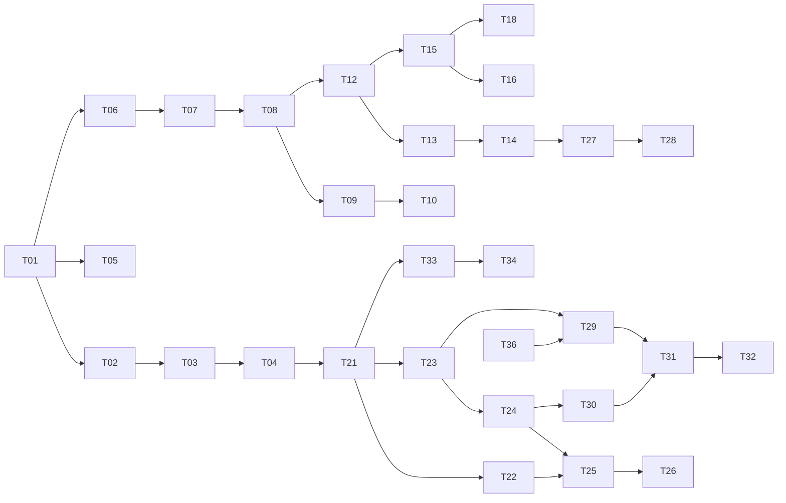

# Resume Builder → Job-Search Platform Roadmap

Evolving the current local Vite app (bullet bank JSON → manual/AI selection → one-page PDF) into a production Next.js platform: accounts, a personal job CRM, a server-side AI engine, a browser extension, and a community job pool with success-based recommendations.

Each task lives in its own file under [`tasks/`](./tasks) and is written to be picked up independently in **Plan mode**.

## How to use this with Plan mode

1. Pick the next unblocked task from the table below (check its **Depends on**).
2. Switch to Plan mode and paste:

   ```text
   Plan @docs/roadmap/tasks/<TASK-FILE>.md.
   Follow the product principles in @docs/roadmap/README.md.
   Read the relevant current code first. Walk me through the "Decisions" section
   (recommend an option for each, let me choose), then produce a step-by-step
   implementation plan with the files to create/change and how to verify it.
   ```

3. After implementing, tick the task in the table and add any decisions you made to the task file's **Decisions log** so later tasks inherit them.

## Product principles (apply to every task)

1. **Zero invented text.** The AI is a _selector/ranker_, never a writer. It picks IDs and versions from the user's own bank. Every AI output is validated server-side against known IDs (the existing `sanitizeTailorResult` pattern). No task may add free-text generation into the resume.
2. **Manual mode is free.** Building, selecting, styling and exporting without AI must cost nothing and never require credits.
3. **PDF only.** No DOCX / plain-text ATS exports. Invest in PDF quality and one-page fit instead.
4. **No server-side scraping.** The user supplies the job link (kept for tracking and sharing) and the JD text (kept as a snapshot). The browser extension reads the page on the user's side.
5. **Semantic, not tags.** Bullet relevance comes from embeddings + LLM ranking, not a hand-maintained tag taxonomy.
6. **Positive signals only.** Recommendations learn from successes (reached screening/interview/offer). Rejections and ghosting are not treated as negative labels.
7. **Resumes are private.** Only job data (link, JD, extracted requirements) can enter the shared pool, and only with opt-in. Resume content never leaves the owner's account.
8. **Cost-aware by default.** Postgres + pgvector instead of a separate vector DB, cache JD analysis by URL/content hash, small embedding models, usage quotas.
9. **Learning project.** Where it doesn't hurt the product, prefer choices that exercise LLM engineering (structured outputs, embeddings, RAG, evals, tracing, LangChain/LangGraph).
10. **Production-grade UX.** Every screen ships with loading, empty and error states, keyboard access, responsive layout and dark mode.

## Phases & tasks

Size: **S** ≈ 1–2 days, **M** ≈ 3–5 days, **L** ≈ 1–2 weeks (solo, part-time estimates are rough).

### Phase 0: Foundation (Next.js migration)

| ✓   | ID                                    | Task                                  | Depends on | Size |
| --- | ------------------------------------- | ------------------------------------- | ---------- | ---- |
| ☑   | [T01](./tasks/T01-nextjs-setup.md)    | Next.js project setup & repo strategy | none       | S    |
| ☑   | [T02](./tasks/T02-design-system.md)   | Design system & app shell             | T01        | M    |
| ☐   | [T41](./tasks/T41-command-palette.md) | Command palette                       | T02        | S    |
| ☐   | [T03](./tasks/T03-port-builder.md)    | Port the resume builder into Next.js  | T01, T02   | M    |
| ☑   | [T04](./tasks/T04-server-tailor.md)   | Move AI Tailor to the server          | T03        | S    |
| ☑   | [T05](./tasks/T05-quality-ci.md)      | Quality tooling, CI & preview deploys | T01        | S    |

### Phase 1: Accounts & bullet bank

| ✓   | ID                                      | Task                                                    | Depends on | Size |
| --- | --------------------------------------- | ------------------------------------------------------- | ---------- | ---- |
| ☐   | [T06](./tasks/T06-database.md)          | Database, ORM & migrations (Postgres + pgvector)        | T01        | S    |
| ☐   | [T07](./tasks/T07-auth.md)              | Authentication & user accounts                          | T06        | M    |
| ☐   | [T08](./tasks/T08-bank-data-model.md)   | Bullet bank data model & JSON import                    | T06, T07   | M    |
| ☐   | [T09](./tasks/T09-bank-manager-ui.md)   | Bullet Bank Manager UI                                  | T08, T02   | L    |
| ☐   | [T10](./tasks/T10-resume-import.md)     | Onboarding: import an existing resume PDF into the bank | T09        | M    |
| ☐   | [T11](./tasks/T11-style-presets-fit.md) | Style presets & one-page fit assistant                  | T03, T08   | M    |

### Phase 2: Personal job CRM

| ✓   | ID                                            | Task                                           | Depends on | Size |
| --- | --------------------------------------------- | ---------------------------------------------- | ---------- | ---- |
| ☐   | [T12](./tasks/T12-jobs-applications-model.md) | Jobs & applications data model                 | T08        | S    |
| ☐   | [T13](./tasks/T13-resume-versions.md)         | Saved resume versions (immutable snapshots)    | T12        | M    |
| ☐   | [T14](./tasks/T14-new-application-flow.md)    | "New application" flow                         | T13, T04   | M    |
| ☐   | [T15](./tasks/T15-applications-dashboard.md)  | Applications dashboard (Kanban + table)        | T12, T02   | L    |
| ☐   | [T16](./tasks/T16-application-detail.md)      | Application detail page                        | T15, T13   | M    |
| ☐   | [T17](./tasks/T17-version-diff.md)            | Resume version diff                            | T13        | S    |
| ☐   | [T18](./tasks/T18-reminders.md)               | Follow-up reminders & one-click status updates | T15        | M    |
| ☐   | [T19](./tasks/T19-sheets-import.md)           | Import tracker from Google Sheets / CSV        | T12        | S    |
| ☐   | [T20](./tasks/T20-personal-insights.md)       | Personal insights & funnel analytics           | T15        | M    |

### Phase 3: AI engine v2

| ✓   | ID                                       | Task                                           | Depends on | Size |
| --- | ---------------------------------------- | ---------------------------------------------- | ---------- | ---- |
| ☐   | [T21](./tasks/T21-llm-provider-layer.md) | LLM provider layer, AI framework choice & BYOK | T04, T07   | M    |
| ☐   | [T22](./tasks/T22-evals-tracing.md)      | LLM evals, tracing & human-override capture    | T21, T13   | M    |
| ☐   | [T23](./tasks/T23-jd-analysis.md)        | JD analysis & requirement extraction (cached)  | T21, T12   | M    |
| ☐   | [T24](./tasks/T24-embeddings.md)         | Embeddings pipeline (pgvector)                 | T08, T23   | M    |
| ☐   | [T25](./tasks/T25-tailor-v2.md)          | Tailor v2: retrieval + LLM ranking             | T22, T24   | L    |
| ☐   | [T26](./tasks/T26-gap-analysis.md)       | Gap analysis & "grow your bank" loop           | T25, T09   | M    |

### Phase 4: Browser extension

| ✓   | ID                                        | Task                                       | Depends on | Size |
| --- | ----------------------------------------- | ------------------------------------------ | ---------- | ---- |
| ☐   | [T27](./tasks/T27-extension-capture.md)   | Chrome extension MVP: capture job → app    | T14        | M    |
| ☐   | [T28](./tasks/T28-extension-one-click.md) | Extension: one-click tailor & PDF download | T27, T25   | M    |

### Phase 5: Community job pool & recommendations

| ✓   | ID                                            | Task                                                | Depends on | Size |
| --- | --------------------------------------------- | --------------------------------------------------- | ---------- | ---- |
| ☐   | [T29](./tasks/T29-shared-job-pool.md)         | Shared job pool (opt-in, dedupe, freshness)         | T23, T36   | M    |
| ☐   | [T30](./tasks/T30-profile-vectors-signals.md) | Candidate profile vectors & success signals         | T24, T12   | M    |
| ☐   | [T31](./tasks/T31-recommendation-engine.md)   | Recommendation engine (semantic → success-weighted) | T29, T30   | L    |
| ☐   | [T32](./tasks/T32-recommendations-ui.md)      | Recommendations page & match alerts                 | T31, T18   | M    |

### Phase 6: Productization

| ✓   | ID                                          | Task                                          | Depends on | Size |
| --- | ------------------------------------------- | --------------------------------------------- | ---------- | ---- |
| ☐   | [T33](./tasks/T33-quotas-metering.md)       | Plans, quotas, usage metering & rate limiting | T21        | M    |
| ☐   | [T34](./tasks/T34-billing.md)               | Billing & subscriptions                       | T33        | M    |
| ☐   | [T35](./tasks/T35-marketing-site.md)        | Marketing site, pricing & legal pages         | T02        | M    |
| ☐   | [T36](./tasks/T36-privacy-data-controls.md) | Privacy & data controls                       | T07, T12   | M    |
| ☐   | [T37](./tasks/T37-admin.md)                 | Admin panel & cost dashboard                  | T33        | M    |
| ☐   | [T38](./tasks/T38-production-ops.md)        | Production deployment & operations            | T05, T06   | M    |

### Phase 7: Later

| ✓   | ID                                   | Task                                          | Depends on | Size |
| --- | ------------------------------------ | --------------------------------------------- | ---------- | ---- |
| ☐   | [T39](./tasks/T39-interview-prep.md) | Interview prep from the version that was sent | T16, T23   | M    |
| ☑   | [T40](./tasks/T40-i18n-rtl.md)       | Hebrew UI / RTL & i18n (optional)             | T02        | M    |

## Suggested milestones

- **M1: "It's my daily tool"** = T01–T09, T12–T15. Replaces your Google Sheet; everything saved per application.
- **M2: "Smarter than ChatGPT copy-paste"** = T16–T18, T21–T26. Server AI with evals, gap analysis, reminders.
- **M3: "Zero friction"** = T27–T28 (+ T38 so others can use it).
- **M4: "Community"** = T29–T32 with T36 in place first.
- **M5: "Sustainable"** = T33–T35, T37.

## Dependency sketch


